# Project Title <!-- omit from toc -->

OneStop is a training project and also my first during my internship at BrainStation-23. The goal was to code and deploy a full fledged, three tier e-commerce application. This serves as hands-on training for DevOps concepts, best practices and tools. This is a solo project, built completely by me from scratch. The choice of technology stack was MERN stack (MongoDB, Express, React, Node). The web app is accessible at https://buy.onestop.rocks/. Below is a overview of the finished product. Following it is a description of the cloud architecture and the devops approaches followed. 

A brief description of your project and its purpose.

## Table of Contents <!-- omit from toc -->
- [Getting Started](#getting-started)
  - [Prerequisites](#prerequisites)
  - [Installing](#installing)
- [Usage](#usage)
  - [Homepage](#homepage)
  - [All Products page](#all-products-page)
  - [Single product page](#single-product-page)
  - [Registration page](#registration-page)
  - [Logging in](#logging-in)
  - [Cart page](#cart-page)
  - [Payment](#payment)
- [Cloud architecture](#cloud-architecture)
  - [Initial Design](#initial-design)
    - [DNS settings](#dns-settings)
    - [SSL settings](#ssl-settings)
  - [Version 2: Scaling the frontend](#version-2-scaling-the-frontend)
    - [Stress testing](#stress-testing)
  - [Version 3: Content Delivery Network (CDN) and SSL](#version-3-content-delivery-network-cdn-and-ssl)
  - [Version 4: Scaling the backend and database](#version-4-scaling-the-backend-and-database)
  - [Version 5: Kubernetes architecture](#version-5-kubernetes-architecture)
    - [Introduction](#introduction)
    - [Kubernetes architecture for project OneStop](#kubernetes-architecture-for-project-onestop)
- [Other DevOps Practices Used](#other-devops-practices-used)
  - [CI/CD Pipeline](#cicd-pipeline)
    - [Jenkins](#jenkins)
    - [AWS Pipeline](#aws-pipeline)
- [Acknowledgements](#acknowledgements)

## Getting Started

These instructions will get you a copy of the project up and running on your local machine for development and testing purposes.

### Prerequisites
You will need to have Node.js and Yarn installed on your machine. You can download the latest version of Node.js from the official website (https://nodejs.org/en/) and Yarn from (https://yarnpkg.com/en/docs/install)

### Installing
1. Clone the repository by running `git clone https://github.com/yusf1013/MERN_Ecommerce`
2. Install the dependencies for the backend by running `cd API && yarn install`
3. Install the dependencies for the frontend by running `cd client && yarn install`
4. Start the backend by running `cd API && yarn start`
5. Start the frontend by running `cd client && yarn start`

The backend will be running on http://localhost:5000 and the frontend will be running on http://localhost:3000

## Usage

### Homepage

### All Products page
Products page is accessible at `/products`. It lists all products and has options to sort them by date and price, and filter by color and size.
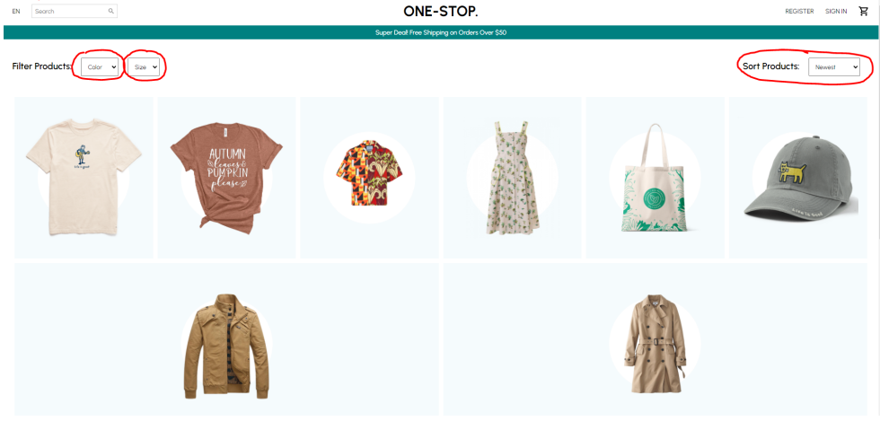

### Single product page
This page is accessible by clicking on any product from  the all products page. For a particular product, the customer can choose the color, size, and quantity.
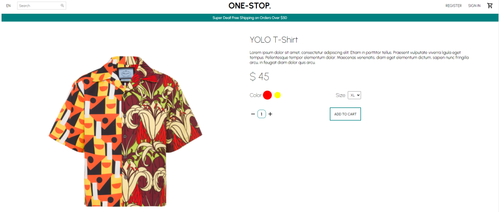

### Registration page
In order to buy products, you need to be signed in. To get started, create an account at `/register`. Successful registration automatically logs you in. 
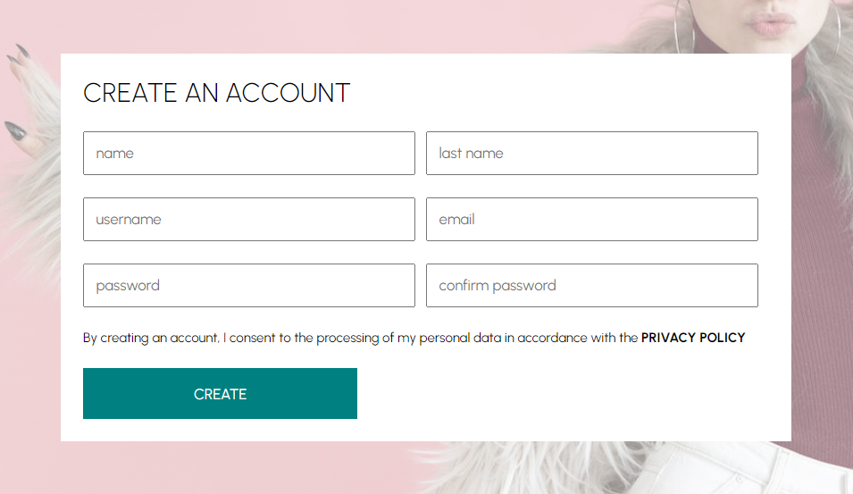

### Logging in
If you already have an account, go to `/login` and enter your credentials to login. 

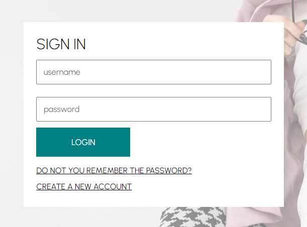

### Cart page
After signing in, the customer can add products to their cart. From the cart page, the product amount can be adjusted. The customer can check the order summary and decide to checkout.
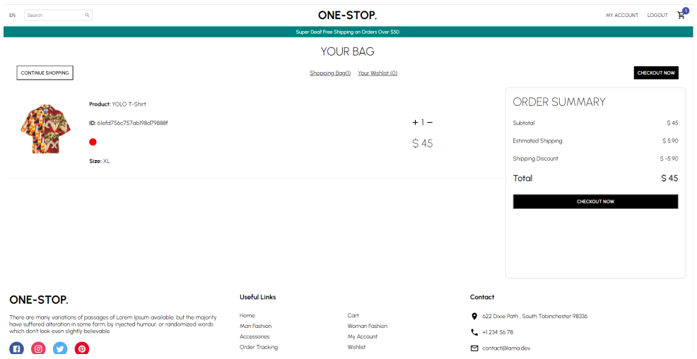

### Payment
During the checkout, customers can pay with their debit or credit card. The payment is handled by a working version of Stripe API.
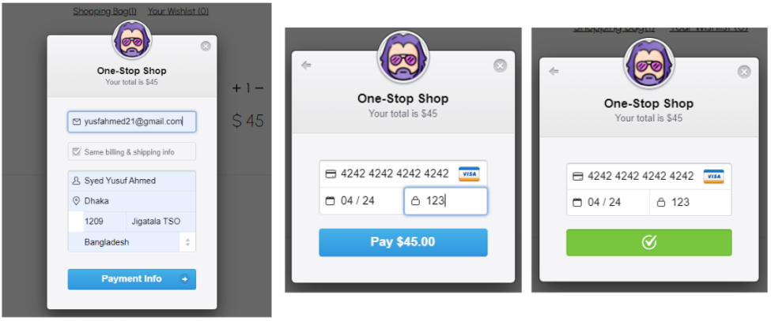

## Cloud architecture
The system was designed with an estimate of a small number of users. Then the system was progressively improved. The progressive development of the system architecture is shown below.

### Initial Design

The app is designed in a three tier architecture. Initially, the deployment is kept as simple as possible by deploying the backend and frontend on the same machine, which would communicate with Atlas, a MongoDB cloud database.

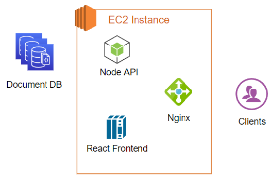

The backend and frontend was hosted on an **EC2 instance**, which is an instance of a virtual machine in AWS. Clients’ requests would go to **nginx server**, which acts as the web server here. Nginx fetches pages from **react frontend**, and data from **node API**. The backend and frontend communicate through nginx as well. Only Node API has access to the persistent database **DocumentDB**, which is AWS’s MongoDB compatible NoSQL database.

#### DNS settings

The domain onestop.rocks was obtained from name.com in association with github student pack. The domain will remain valid for one year from the date of acquisition.

#### SSL settings

The endpoints at buy.onestop.rocks can be accessed securely through SSL with HTTPS. For this, I have obtained and set up a free SSL certificate from Cert Bot, which is powered by FaceBook.

### Version 2: Scaling the frontend

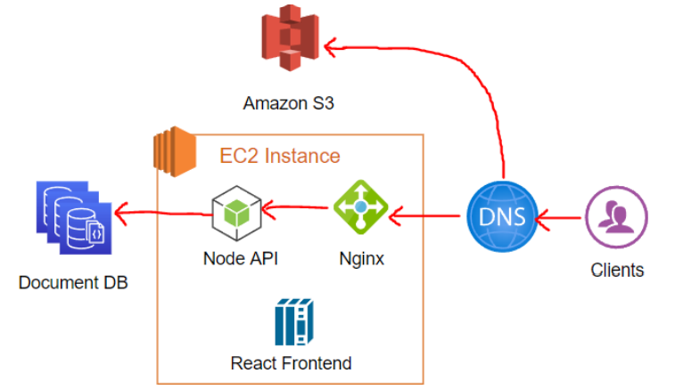

The next step is to scale the frontend using **Amazon S3**, as shown in the figure above. Amazon S3 is an object storage service from Amazon. It has been used to host the React frontend production build which are static files.

The benefits are that S3 is a managed service. Which means that AWS ensures its scalability, high reliability and high availability. For example AWS boasts S3’s virtually unlimited scalability, and a very high availability of 99.99%. 99.99% availability is good for most applications, but further boost is trivial to manage by setting up another replica S3 bucket behind a load balancer.

The diagram also shows the **path of a typical request**. Clients request static files from S3. These static files will query Nginx for data. Nginx will provide the data by asking the Node API, which fetches the requested data from DocumentDB.

#### Stress testing

The difference between version 1 and 2 was tested with a stress testing tool **BlazeMeter**. BlazeMeter emulates hundreds or even thousands of requests from multiple virtual users and collects metrics like latency, error rate, hit rate, etc. These metrics, combined with those provided by AWS can tell which version is better suited for which situation. Both tests were done with similar settings for a fair test. Here are the results of the stress test.

Stress testing version 1:

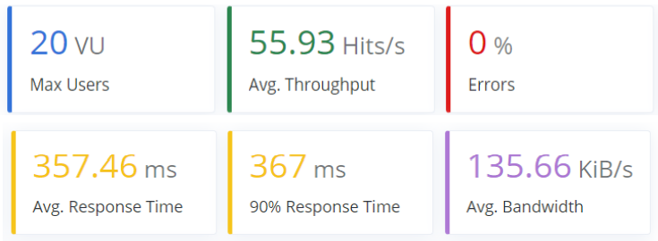

Stress testing version 2: 

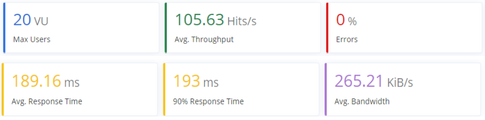

The results are in favor of version 2, with it having 47% lower latency even with almost double throughput. This is expected since version 2 uses S3, which is specialized for handling static files. But with more benefits come more costs, hence version 2 is more expensive for high load.

### Version 3: Content Delivery Network (CDN) and SSL

By default, requests served this way will only run over HTTP. To integrate SSL certificates, we need **CloudFront**, which is Amazon’s Content Delivery Network **(CDN)**. Apart from SSL integration, CDN’s further reduce latency and improve performance by caching the data at multiple locations around the world. This way, the static files do not have to be fetched from the S3 storage every time. Instead, the client receives a copy cached geographically much closer to the client. The setup is shown here -

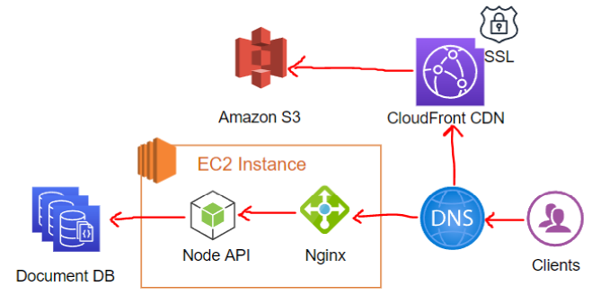

### Version 4: Scaling the backend and database

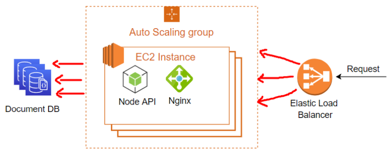

Instead of a single EC2 machine hosting the backend, we now have a fleet of servers each doing the same thing. The instances are in an **Auto Scaling Group (ASG)**. ASG’s use CloudWatch Metrics to automatically add more servers when either one or more instances are not healthy, or when the CPU utilization exceeds a certain value. ASG can also remove instances that are unhealthy or have low utilization. An **Elastic Load Balancer (ELB)** distributes the load of incoming requests to each machine in the ASG. Database scaling is handled by adding more DocumentDB clusters. A total of three clusters were used. No further changes were made to the frontend in S3, CloudFront distribution, and DNS records. 

### Version 5: Kubernetes architecture
The final version of project OneStop includes packaging the frontend and backend in containers, and deploying them in two separate deployments in kubernetes. 

#### Introduction

Typically, the Kubernetes architecture involves a cluster of nodes. **Nodes** are the smallest unit of computer hardware in Kubernetes. Nodes store and process data. Nodes can be physical computers or virtual machines (VMs).

Nodes are two types - Master nodes or control planes and worker nodes. Inside worker nodes run multiple **pods**, which are the smallest execution unit in Kubernetes. A pod encapsulates one or more containerized applications (such as Docker containers). Every cluster has at least one worker node. The job of the **worker node(s)** is to host the Pods that are the components of the application workload. **The master nodes** manage the worker nodes and the Pods in the cluster. The processes running inside worker nodes are called worker processes, and those running in master nodes are called master processes. In production environments, the control plane usually runs across multiple computers and a cluster usually runs multiple nodes, providing fault-tolerance and high availability.

#### Kubernetes architecture for project OneStop

For project OneStop, the cluster had to be run locally in test environments where resources like RAM and CPU are very limited. This is when **Minikube** is to be used. Minikube is an open source tool that allows a kubernetes cluster to run on a single node. Minikube brings all worker and master processes in one node and allows them to run as if they were running on different nodes. This is shown below -

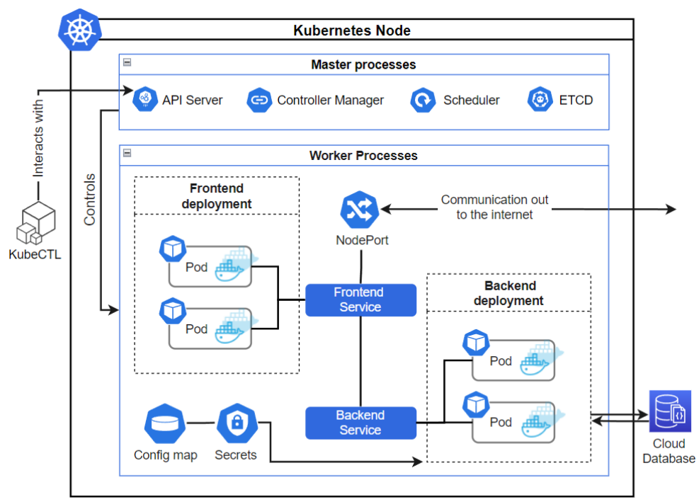

As seen in the figure above, the master processes include API server, controller manager, scheduler, and etcd.
- API server - The API server is a component of the Kubernetes control plane that exposes the Kubernetes API. It is the entry point to the Kubernetes cluster. The cluster can be controlled by the developers by using Kubectl, a command line tool that connects to the API server to send commands. 
- Etcd - Consistent and highly-available key value store used as Kubernetes' backing store for all cluster data. 
- Scheduler - Control plane component that watches for newly created Pods with no assigned node, and selects a node for them to run on. 
- Controller manager - Control plane component that runs controller processes. Its responsibilities include noticing and responding when nodes go down, joining services and pods, etc.

The worker process includes two **deployments**, frontend and backend. Each deployment contains two pods running the same thing. The pods are replicas of each other. So, the frontend deployment contains two replicas running the React frontend in a docker container; and the backend contains two replicas running the Node API in a docker container. The pods can communicate with each other with the help of **services**. These services are strictly internal and not accessible from the outside. Requests from the client reach **NodePort**, which exposes the service to the clients and the outside world. NodePort maps ports of the cluster to an externally accessible port. In this case, NodePort exposes both the backend service and frontend service to the outside world. Clients; requests can now reach the frontend service, which sends the request to one of the two pods in the frontend deployment. Similarly, the frontend, now in the clients’ machine, can access the backend service from the NodePort. Again, the backend service acts as a load balancer for the two pods in deployment.

In order to function, the backend pods require nonsensitive configuration data like database URL and sensitive data like API keys. These information are fetched from **config map** and **secrets** storage respectively.

It is to be noted that the services come with a built in load balancer. Which means the system will handle itself when one replica goes down. In case of rising workload, the number of replicas can be increased by changing one line of code, and the rest is handled by kubernetes.

## Other DevOps Practices Used

### CI/CD Pipeline
A problem that I faced during coding versions 1 - 4 is that for every small change that I made, I would have to repeat all the steps required for deployment - checking out from version control, installing dependencies, running build, deploying build files, testing the build, etc. And if, for some reason, it did not pass the tests on the deployment server, the whole cycle would have to be repeated. This was a training project, but for real world applications, there would be many more steps and more parties involved like other teams of developers, testers, system administrators, etc. In addition, deployment may have to be done on multiple servers distributed geographically. Hence repeating this entire process from start to finish for every small change is impractical.

This is where CI/CD comes in. Here, CI stands for continuous integration and CD stands for continuous deployment. The idea is to automate the tasks of this process. Reducing the tedious manual tasks make the process doable and reduces time waste. For training, we learnt two very popular CI/CD tools, Jenkins and AWS Pipeline. 

#### Jenkins

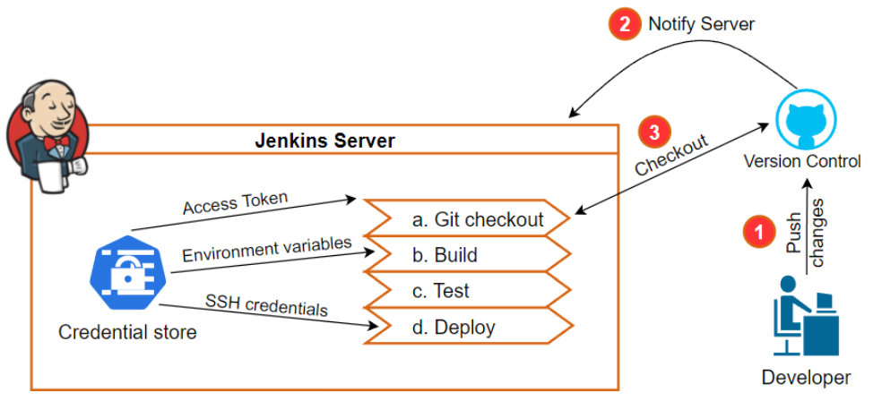

The goal is to automate the activities after code is pushed to **version control**. In this case, GitHub was used. GitHub notifies the **Jenkins Server** which was running in an EC2 instance (AWS virtual machine). Jenkins performs **build**, **test**, and **deploy** scripts by retrieving secret credentials from the **credentials store**, which is a secure way of storing the credentials. For deployment, these steps are followed:
- SSH into the production server 
- Synchronize files with Jenkins server 
- Start service 
If an error is encountered in any stage, the pipeline is halted and the developer is notified.

For the project OpeStop, I used Jenkins to automate the deployment of the Node API. Scripts for build, test, and deploy can be written in Groovy syntax or declarative syntax in a Jenkinsfile. I choose declarative syntax.

#### AWS Pipeline

AWS Pipeline is similar to Jenkins in what it does. But it is a more managed service of AWS. In the case of Jenkins, I had to configure and manage a Jenkins server, but this would not be required for the AWS pipeline. But unlike Jenkins, the AWS pipeline is not free. In this project, I used AWS Pipeline to automate the deployment of the frontend to Amazon S3. 

## Acknowledgements

I would like to express my heartfelt gratitude to [BrainStation-23](https://brainstation-23.com/) for providing me with the opportunity to take part in an internship program, which has been a valuable learning experience for me. The training and resources that were provided by the company have been instrumental in the development of this project. Their unwavering support throughout this journey has been truly appreciated.

I would also like to express my deepest appreciation to my mentor, Rafed Muhammad Yasir. He has been an incredible mentor to me, always going above and beyond to help me whenever I needed it. His guidance, support and mentorship has been invaluable in helping me to improve and grow. I am truly grateful to have had the opportunity to learn from him.

Lastly, I would like to extend my sincere thanks to the Institute of Information Technology, University of Dhaka, for arranging this internship opportunity.